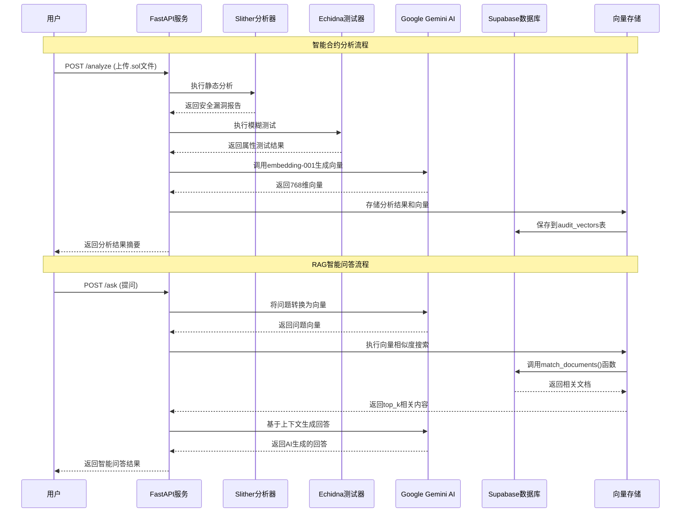

# RAG审计API - 智能合约安全分析系统

基于RAG（检索增强生成）架构的智能合约安全审计分析系统，集成Slither静态分析、Echidna模糊测试和Google Gemini AI，提供智能化的合约安全问答服务。

## 🚀 核心功能

- **智能合约分析**: 集成Slither和Echidna进行全面的安全分析
- **RAG智能问答**: 基于向量检索的智能合约安全问题解答
- **批量数据处理**: 支持审计报告的批量上传和向量化存储
- **多源数据支持**: 支持文件上传和Etherscan地址分析

## 📊 系统架构

### 整体架构图

```mermaid
graph TB
    %% 用户交互层
    subgraph "用户交互层"
        UI[Web界面/API客户端]
        CLI[命令行工具]
    end
    
    %% API网关层
    subgraph "API服务层"
        API[FastAPI服务器<br/>rag_audit_api.py]
        HEALTH[/health - 健康检查]
        ANALYZE[/analyze - 合约分析]
        INGEST[/ingest - 批量上传]
        ASK[/ask - 智能问答]
    end
    
    %% 核心处理层
    subgraph "智能合约分析引擎"
        SLITHER[Slither静态分析<br/>安全漏洞检测]
        ECHIDNA[Echidna模糊测试<br/>属性验证]
        PARSER[报告解析器<br/>flatten_slither/echidna]
    end
    
    %% AI处理层
    subgraph "AI智能处理层"
        GEMINI[Google Gemini AI]
        EMBED[文本向量化<br/>embedding-001]
        GEN[文本生成<br/>gemini-pro]
    end
    
    %% 数据存储层
    subgraph "数据存储层"
        SUPABASE[(Supabase数据库)]
        VECTORS[(audit_vectors表<br/>向量存储)]
        SEARCH[向量相似度搜索<br/>match_documents()]
    end
    
    %% 外部服务
    subgraph "外部服务"
        ETHERSCAN[Etherscan API<br/>合约源码获取]
        GITHUB[GitHub<br/>代码仓库]
    end
    
    %% 数据流连接
    UI --> API
    CLI --> API
    
    API --> HEALTH
    API --> ANALYZE
    API --> INGEST
    API --> ASK
    
    %% 分析流程
    ANALYZE --> SLITHER
    ANALYZE --> ECHIDNA
    ANALYZE --> ETHERSCAN
    
    SLITHER --> PARSER
    ECHIDNA --> PARSER
    
    %% 数据处理流程
    PARSER --> EMBED
    INGEST --> EMBED
    EMBED --> GEMINI
    EMBED --> VECTORS
    
    %% 问答流程
    ASK --> EMBED
    ASK --> SEARCH
    SEARCH --> VECTORS
    VECTORS --> GEN
    GEN --> GEMINI
    
    %% 存储连接
    VECTORS --> SUPABASE
    SEARCH --> SUPABASE
    
    %% 样式定义
    classDef userLayer fill:#e1f5fe
    classDef apiLayer fill:#f3e5f5
    classDef analysisLayer fill:#fff3e0
    classDef aiLayer fill:#e8f5e8
    classDef dataLayer fill:#fce4ec
    classDef externalLayer fill:#f1f8e9
    
    class UI,CLI userLayer
    class API,HEALTH,ANALYZE,INGEST,ASK apiLayer
    class SLITHER,ECHIDNA,PARSER analysisLayer
    class GEMINI,EMBED,GEN aiLayer
    class SUPABASE,VECTORS,SEARCH dataLayer
    class ETHERSCAN,GITHUB externalLayer
```

## 🔄 数据流程

### RAG问答流程时序图



## 🛠️ 技术栈架构

### 技术组件详细架构

```mermaid
graph LR
    subgraph "前端层"
        A[API客户端]
        B[测试脚本]
        C[命令行工具]
    end

    subgraph "API服务层 - FastAPI"
        D[rag_audit_api.py]
        E[路由处理]
        F[请求验证]
        G[错误处理]
    end

    subgraph "业务逻辑层"
        H[合约分析逻辑]
        I[文档处理逻辑]
        J[向量化处理]
        K[问答逻辑]
    end

    subgraph "分析工具层"
        L[Slither v0.9.3<br/>静态分析]
        M[Echidna<br/>模糊测试]
        N[Solidity编译器]
    end

    subgraph "AI服务层 - Google Gemini"
        O[embedding-001<br/>文本向量化]
        P[gemini-pro<br/>文本生成]
        Q[重试机制<br/>错误处理]
    end

    subgraph "数据存储层 - Supabase"
        R[(PostgreSQL数据库)]
        S[pgvector扩展<br/>向量存储]
        T[audit_vectors表<br/>768维向量]
        U[match_documents()<br/>相似度搜索]
    end

    subgraph "外部API"
        V[Etherscan API<br/>合约源码]
        W[GitHub API<br/>代码仓库]
    end

    subgraph "配置与环境"
        X[环境变量<br/>API密钥]
        Y[日志系统<br/>错误追踪]
        Z[测试框架<br/>pytest]
    end

    %% 连接关系
    A --> D
    B --> D
    C --> D

    D --> E
    E --> F
    F --> G

    D --> H
    D --> I
    D --> J
    D --> K

    H --> L
    H --> M
    H --> N
    H --> V

    I --> O
    J --> O
    K --> O
    K --> P

    O --> Q
    P --> Q

    J --> S
    K --> U
    S --> R
    U --> R
    T --> R

    H --> W

    D --> X
    D --> Y
    G --> Y

    B --> Z

    %% 样式
    classDef frontend fill:#e3f2fd
    classDef api fill:#f3e5f5
    classDef business fill:#fff8e1
    classDef analysis fill:#e8f5e8
    classDef ai fill:#fce4ec
    classDef data fill:#f1f8e9
    classDef external fill:#fff3e0
    classDef config fill:#f9fbe7

    class A,B,C frontend
    class D,E,F,G api
    class H,I,J,K business
    class L,M,N analysis
    class O,P,Q ai
    class R,S,T,U data
    class V,W external
    class X,Y,Z config
```

### 核心技术组件

- **后端框架**: FastAPI
- **AI服务**: Google Gemini AI (embedding-001, gemini-pro)
- **数据库**: Supabase (PostgreSQL + pgvector)
- **分析工具**: Slither v0.9.3, Echidna
- **向量存储**: 768维向量嵌入
- **外部API**: Etherscan API
- **测试框架**: pytest

## 🔑 核心特性

### RAG架构优势
- **检索增强生成**: 结合向量检索和AI生成，提供准确的智能合约审计问答
- **语义搜索**: 基于768维向量的语义相似度搜索
- **上下文感知**: 根据检索到的相关审计报告生成针对性回答

### 多工具集成
- **Slither静态分析**: 检测常见的智能合约安全漏洞
- **Echidna模糊测试**: 基于属性的自动化测试
- **双重验证**: 静态分析和动态测试相结合

### 容错与性能
- **重试机制**: 针对AI API超时的指数退避重试
- **备用方案**: 零向量备用确保系统稳定性
- **并发处理**: 支持批量数据处理和并发请求

### 数据处理能力
- **多格式支持**: Solidity源码、JSON报告、合约地址
- **批量处理**: 支持大规模审计报告的批量上传和处理
- **增量更新**: 支持审计数据的增量添加和更新

## 🚀 快速开始

### 环境配置

```bash
# 设置环境变量
export SUPABASE_URL="your-supabase-url"
export SUPABASE_KEY="your-supabase-key"
export GOOGLE_API_KEY="your-google-api-key"
export ETHERSCAN_API_KEY="your-etherscan-key"  # 可选
```

### 安装依赖

```bash
pip install -r requirements.txt
```

### 启动服务

```bash
# 开发模式
uvicorn app.rag_audit_api:app --reload

# 生产模式
uvicorn app.rag_audit_api:app --host 0.0.0.0 --port 8000
```

## 📡 API接口

| 接口 | 方法 | 描述 |
|------|------|------|
| `/health` | GET | 健康检查 |
| `/analyze` | POST | 智能合约分析 |
| `/ingest` | POST | 批量上传审计报告 |
| `/ask` | POST | RAG智能问答 |

## 🧪 测试

```bash
# 运行冒烟测试（快速验证）
python run_tests_unified.py smoke

# 运行完整测试
python run_tests_unified.py all

# 使用pytest
pytest tests/test_pytest.py -v
```

详细测试说明请参考 [TEST_README.md](TEST_README.md)

## 💡 使用示例

### 智能合约分析
```bash
curl -X POST "http://localhost:8000/analyze" \
  -F "files=@contract.sol" \
  -F "contract_name=MyContract"
```

### RAG智能问答
```bash
curl -X POST "http://localhost:8000/ask" \
  -H "Content-Type: application/json" \
  -d '{
    "question": "什么是重入攻击？如何防范？",
    "top_k": 5
  }'
```

### 批量上传审计报告
```bash
curl -X POST "http://localhost:8000/ingest" \
  -F "files=@slither_report.json" \
  -F "files=@echidna_report.json"
```

## 📁 项目结构

```
├── app/
│   └── rag_audit_api.py      # 主API服务
├── tests/                    # 测试文件
├── run_tests_unified.py      # 统一测试脚本
├── requirements.txt          # 依赖列表
└── README.md                # 项目文档
```

## 🔧 部署

支持Docker部署，详见 [deployment_setup.md](deployment_setup.md)

```bash
# Docker构建和运行
docker build -t rag-audit-api .
docker run -p 8000:8000 --env-file .env rag-audit-api
```

## 🤝 贡献指南

1. Fork 项目
2. 创建特性分支 (`git checkout -b feature/AmazingFeature`)
3. 提交更改 (`git commit -m 'Add some AmazingFeature'`)
4. 推送到分支 (`git push origin feature/AmazingFeature`)
5. 打开 Pull Request

## 📈 路线图

- [ ] 支持更多静态分析工具 (MythX, Securify)
- [ ] 增加智能合约形式化验证
- [ ] 支持多链智能合约分析
- [ ] 添加Web前端界面
- [ ] 集成更多AI模型选择

## 🐛 问题反馈

如果您遇到任何问题或有改进建议，请在 [Issues](https://github.com/your-repo/rag-audit-api/issues) 中提出。

## 📄 许可证

MIT License

## 🙏 致谢

- [Slither](https://github.com/crytic/slither) - 智能合约静态分析工具
- [Echidna](https://github.com/crytic/echidna) - 智能合约模糊测试工具
- [Google Gemini AI](https://ai.google.dev/) - AI服务支持
- [Supabase](https://supabase.com/) - 数据库和向量存储
- [FastAPI](https://fastapi.tiangolo.com/) - 现代Python Web框架
